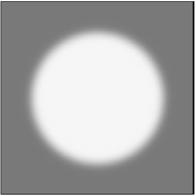
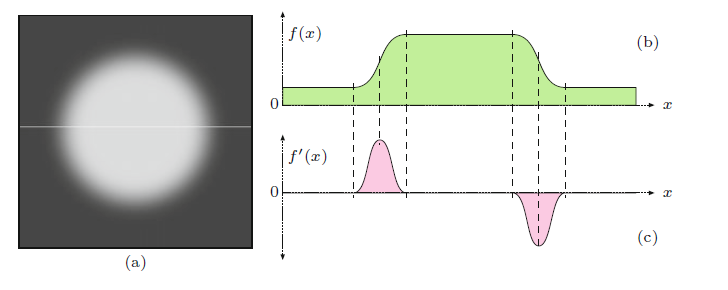
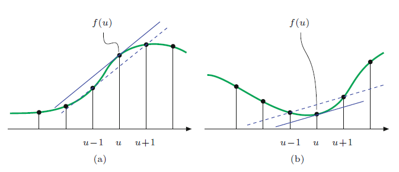

---
# Edge Detection

+++
## Table of Contents
1. What makes an edge?
2. Basics of gradient-based edgedetection
3. Advanced gradient-based edgedetection
4. compass operators
5. (can be left) medical use

---
## What makes an edge?

+++

@snap[north-east] ### Problem I: similiar colours @snapend

+++?image=images/gradientchange.jpg
### Problem II: minor changes

+++
### Problem III: random noise

+++
### Definition
@quote[In Image Processing, an edge can be defined as a set of contiguous pixel positions where an abrupt change of intensity, gray- or color-values occur. Edges represent boundaries between objects and background. Sometimes, the edge-pixel-sequence may be broken due to insufficient intensity difference.](Malay K. Pakhira )

---
## The basics of gradient-based edgedetection

+++
@transition[none]

@snap[east]

@snapend

@snap[north]
<h3> Image-requirements</h3>
@snapend

@snap[west]
Requirements:  
<ol>
<li>1. color values known </li>
<li>2. picture scale known </li>
<li>3. load as pixelmatrix </li>
</ol>
@snapend

+++
@snap[midpoint]

@snapend

@snap[north]
<h3> One dimensional approach </h3>
@snapend

@snap[south]
@size[9](take one row of the matrix, and plot a function and a derivative)
@snapend

+++
@snap[south]

@snapend
@snap[north] 
@size[7](Problem: image can only be seen as discrete function (pixel per pixel))
 Therefore: $$\dfrac{df}{dx}(u) \approx \dfrac{f(u+1) - f(u-1)}{(u+1)-(u-1)} = \dfrac{f(u+1) - f(u-1)}{2}$$ 
@snapend

+++
### Two dimensional approach
When working with *real* images, we have two dimensions and therefore two partial derivations:

$$I_x = \dfrac{\delta I}{\delta x}(u,v)$$ and $$I_y = \dfrac{\delta I}{\delta y}(u,v)$$

The Gradient at the point *(u,v)* is therefore 
$$\nabla I(u,v) = \twocolvec{I_x(u,v)}{I_y(u,v)}$$

And the **magnitude** therefore $$|\nabla I|=\sqrt{I_x^2 + I_y^2}$$
+++

+++
### Applying a filter
show how to scale the derivatives and why its usefull

---
## Advanced gradient-based edgedetection

+++
### Using 3x3 filters
basic Idea how we can apply 3x3 filters to our picture

+++
### Prewitt Operator

+++
### Sobel Operator

+++
### Calculating the direction
show arctang and what it does

show possible problems

---
## Compass Operators
Idea and Main Problems (Tradeoff Edge-Detection and Direction-Detection)

+++
### Extended Sobel Operator
Show the Extended Sobel operators and why we have 8 of them now, what we are doing with them and why its good.

+++
### Kirsch Operator
i guess just presenting it would be enough, if i explain a lot at the extended sobel

+++
### Canny-Edge Operator
why its the "best" and how it works with 2nd derivative

---
## Edge sharpening

+++
### Smoothing

---
## Medical use
Iff i still have time to fill or i find something very nice dudes

---
## Questions
also list primary sources here